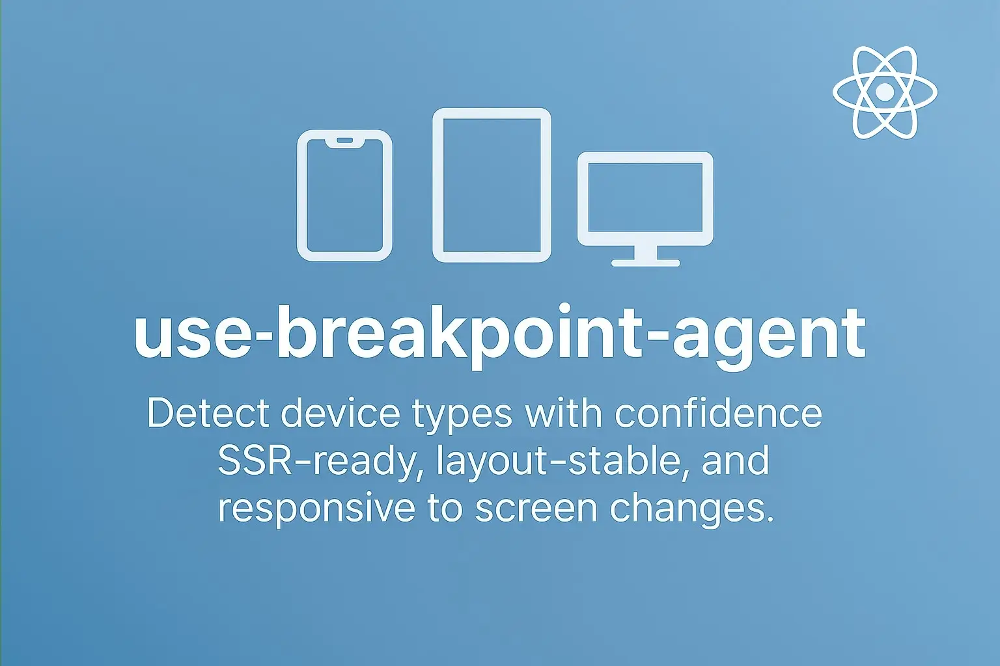

# use-breakpoint-agent

A lightweight and reliable React hook for determining the user's device type (`mobile`, `tablet`, or `desktop`) based on screen width.

This package supports **Server-Side Rendering (SSR)** by accepting an initial value during the server pass, which helps prevent **layout shift** and ensures a consistent UI experience from server to client.

It also updates the device type **synchronously when the window size changes**, ensuring real-time accuracy as users resize or switch their viewports.

Perfect for responsive designs, conditional rendering, and stable multi-device support.

[](https://www.npmjs.com/package/use-breakpoint-agent)
[](LICENSE)



## ✨ Features

- ✅ SSR-friendly with initial server value
- 📱 Detects device type from screen width
- 🧬 Works with all React versions that support hooks
- ⚛️ Works with Next.js, Vite, CRA, and any React project
- 💡 Lightweight and easy to use

## 📦 Installation

```bash
npm install use-breakpoint-agent
# or
yarn add use-breakpoint-agent
# or
pnpm add use-breakpoint-agent
```

## 🚀 Usage

### 🌐 In Next.js (App Router)

1. Detect Device on the Server with `Server Actions`:

```tsx
// app/actions/get-device-type.ts
"use server";
import { headers } from "next/headers";
import { getDeviceTypeFromHeaders } from "use-breakpoint-agent/server";
import { DeviceEnum } from "use-breakpoint-agent";

export async function getDeviceType(): DeviceEnum {
  const headerList = headers();
  return getDeviceTypeFromHeaders(headerList);
}
```

2. Use it in a server component (e.g. `page.tsx`):

```tsx
// app/page.tsx
import { getDeviceType } from "./actions/get-device-type";
import MyComponent from "./MyComponent";

export default async function Page() {
  const serverDevice = await getDeviceType();
  return <MyComponent serverDevice={serverDevice} />;
}
```

3. Use the `useBreakpointAgent` hook in your component to get the current device type:

```tsx
"use client";
import { useBreakpointAgent, DeviceEnum } from "use-breakpoint-agent";

export default function MyComponent({ serverDevice }: { serverDevice: DeviceEnum }) {
  const device = useBreakpointAgent(serverDevice);
  return <div>You are using: {device}</div>;
}
```

### 🧭 In Next.js (Page Router)

1.  Detect Device on the Server with `getServerSideProps`:

```tsx
// pages/index.tsx
import { getDeviceTypeFromHeaders } from "use-breakpoint-agent/server";
import { DeviceEnum } from "use-breakpoint-agent";
import MyComponent from "../components/MyComponent";

export async function getServerSideProps({ req }: { req: Request }) {
  const serverDevice = getDeviceTypeFromHeaders(req.headers);
  return { props: { serverDevice } };
}

export default function Home({ serverDevice }: { serverDevice: DeviceEnum }) {
  return <MyComponent serverDevice={serverDevice} />;
}
```

2. Use the `useBreakpointAgent` hook in your component to get the current device type:

```tsx
import { useBreakpointAgent, DeviceEnum } from "use-breakpoint-agent";

export default function MyComponent({ serverDevice }: { serverDevice: DeviceEnum }) {
  const device = useBreakpointAgent(serverDevice);
  return <div>You are using: {device}</div>;
}
```

### ⚡ In Vite + React SSR

1. Detect Device on the Server with `express server`:

```tsx
// server.js
import fs from "node:fs/promises";
import express from "express";
import { Transform } from "node:stream";
import { getDeviceTypeFromHeaders } from "use-breakpoint-agent/server";

// Constants
const isProduction = process.env.NODE_ENV === "production";
const port = process.env.PORT || 5173;
const base = process.env.BASE || "/";
const ABORT_DELAY = 10000;

// Cached production assets
const templateHtml = isProduction ? await fs.readFile("./dist/client/index.html", "utf-8") : "";

// Create http server
const app = express();

// Add Vite or respective production middlewares
/** @type {import('vite').ViteDevServer | undefined} */
let vite;
if (!isProduction) {
  const { createServer } = await import("vite");
  vite = await createServer({
    server: { middlewareMode: true },
    appType: "custom",
    base,
  });
  app.use(vite.middlewares);
} else {
  const compression = (await import("compression")).default;
  const sirv = (await import("sirv")).default;
  app.use(compression());
  app.use(base, sirv("./dist/client", { extensions: [] }));
}

// Serve HTML
app.use("*all", async (req, res) => {
  try {
    const url = req.originalUrl.replace(base, "");

    /** @type {string} */
    let template;
    /** @type {import('./src/entry-server.ts').render} */
    let render;
    if (!isProduction) {
      // Always read fresh template in development
      template = await fs.readFile("./index.html", "utf-8");
      template = await vite.transformIndexHtml(url, template);
      render = (await vite.ssrLoadModule("/src/entry-server.tsx")).render;
    } else {
      template = templateHtml;
      render = (await import("./dist/server/entry-server.js")).render;
    }

    let didError = false;

    const device = getDeviceTypeFromHeaders(req.headers);

    const { pipe, abort } = render(url, {
      device, //👈 Added device to `render` options
      onShellError() {
        res.status(500);
        res.set({ "Content-Type": "text/html" });
        res.send("<h1>Something went wrong</h1>");
      },
      onShellReady() {
        res.status(didError ? 500 : 200);
        res.set({ "Content-Type": "text/html" });

        const transformStream = new Transform({
          transform(chunk, encoding, callback) {
            res.write(chunk, encoding);
            callback();
          },
        });

        const [htmlStart, htmlEnd] = template.split(`<!--app-html-->`);

        res.write(htmlStart);

        transformStream.on("finish", () => {
          res.end(htmlEnd);
        });

        pipe(transformStream);
      },
      onError(error) {
        didError = true;
        console.error(error);
      },
    });

    setTimeout(() => {
      abort();
    }, ABORT_DELAY);
  } catch (e) {
    vite?.ssrFixStacktrace(e);
    console.log(e.stack);
    res.status(500).end(e.stack);
  }
});

// Start http server
app.listen(port, () => {
  console.log(`Server started at http://localhost:${port}`);
});
```

2. Create a Custom Server-Side Render Function to Inject Device Info:

```tsx
// src/entry-server.tsx
import { StrictMode } from "react";
import { type RenderToPipeableStreamOptions, renderToPipeableStream } from "react-dom/server";
import App from "./App";
import { DeviceEnum } from "use-breakpoint-agent";

export function render(_url: string, options?: RenderToPipeableStreamOptions & { device?: DeviceEnum }) {
  const serverDevice = options?.device!;
  if (options) delete options.device;

  return renderToPipeableStream(
    <StrictMode>
      <App serverDevice={serverDevice} />
    </StrictMode>,
    options
  );
}
```

3. Hydrate the app on the client and detect the device from the user agent:

```tsx
// src/entry-client.tsx
import "./index.css";
import { StrictMode } from "react";
import { hydrateRoot } from "react-dom/client";
import App from "./App";
import { getDeviceTypeFromString } from "use-breakpoint-agent/client";

hydrateRoot(
  document.getElementById("root") as HTMLElement,
  <StrictMode>
    <App serverDevice={getDeviceTypeFromString(navigator.userAgent)} />
  </StrictMode>
);
```

4. Use the passed device in your React app component and render your UI with lazy loading support:

```tsx
// src/App.tsx
import "./App.css";
import { Suspense, lazy } from "react";
import { DeviceEnum } from "use-breakpoint-agent";

// Works also with SSR as expected
const MyComponent = lazy(() => import("./MyComponent"));

function App({ serverDevice }: { serverDevice: DeviceEnum }) {
  return (
    <>
      <h1>Vite + React SSR</h1>

      <Suspense fallback={<p>Loading component...</p>}>
        <MyComponent serverDevice={serverDevice} />
      </Suspense>
    </>
  );
}

export default App;
```

5. Use the `useBreakpointAgent` hook in your component to get the current device type:

```tsx
import { DeviceEnum, useBreakpointAgent } from "use-breakpoint-agent";

function MyComponent({ serverDevice }: { serverDevice: DeviceEnum }) {
  const device = useBreakpointAgent(serverDevice);
  return <div>You are using: {device}</div>;
}

export default MyComponent;
```

### ⚙️ Using with Other React SSR Frameworks

This example shows how you can adapt the device detection and server-side rendering logic to any React SSR environment. As long as your framework supports React server rendering and provides access to request headers, you can implement a similar pattern by:

1. Detecting the device type on the server from incoming request headers

2. Passing the detected device type down to your React app as a prop

3. Using the useBreakpointAgent hook on the client to sync device state

Here is a generic template to guide you:

```tsx
// your SSR entry point
import { getDeviceTypeFromHeaders } from "use-breakpoint-agent/server";
import { renderToString } from "react-dom/server";
import App from "./App";

export async function handleRequest(req, res) {
  try {
    const device = getDeviceTypeFromHeaders(req.headers);

    const appHtml = renderToString(<App serverDevice={device} />);

    const html = `
      <!DOCTYPE html>
      <html lang="en">
        <head><title>My SSR App</title></head>
        <body>
          <div id="root">${appHtml}</div>
          <script src="/client-bundle.js"></script>
        </body>
      </html>
    `;

    res.statusCode = 200;
    res.setHeader("Content-Type", "text/html");
    res.end(html);
  } catch (err) {
    res.statusCode = 500;
    res.end("Internal Server Error");
  }
}
```

💡 **Note:** You can adjust this template to fit your SSR framework’s conventions and lifecycle. Just make sure to **hydrate the app on the client and detect the device from the user agent** (as shown in example ⚡ In Vite + React SSR — step 3).

---

## ⚙️ API

### `useBreakpointAgent(serverDevice, breakpoints)`

| Param          | Type                                    | Description                                                                                                                                |
| -------------- | --------------------------------------- | ------------------------------------------------------------------------------------------------------------------------------------------ |
| `serverDevice` | `DeviceEnum`                            | Used during SSR to guess the device type. If provided, the return type will be `DeviceEnum`; otherwise, it will be `DeviceEnum` or `null`. |
| `breakpoints`  | `{ mobile?: number; tablet?: number; }` | Optional screen breakpoints                                                                                                                |

Returns the current device type (`mobile` | `tablet` | `desktop`).

### `getDeviceTypeFromString(userAgent: string | undefined): DeviceEnum`

Determines device from user-agent string.

### `getDeviceTypeFromHeaders(headers: Headers): DeviceEnum`

Gets user-agent from headers and returns the device type.

**Note:** If the input is `undefined` or the device type cannot be determined, it will default to `desktop`.

## 📐 Breakpoints

| Device  | Width (px)            |
| ------- | --------------------- |
| Mobile  | `<= 768px`            |
| Tablet  | `> 768px && < 1024px` |
| Desktop | `>= 1024px`           |

You can override these defaults by passing a second argument:

```tsx
useBreakpointAgent(serverDevice, { mobile: 600, tablet: 900 });
```

## 🧩 Types And Enums

### `DeviceEnum`

```ts
enum DeviceEnum {
  MOBILE = "mobile",
  TABLET = "tablet",
  DESKTOP = "desktop",
}
```

### `BreakpointConfigType`

```ts
type BreakpointConfigType = { mobile?: number; tablet?: number };
```

---

## 📝 License

MIT — © [Soheil Jafarnejad](https://github.com/soheiljafarnejad)
